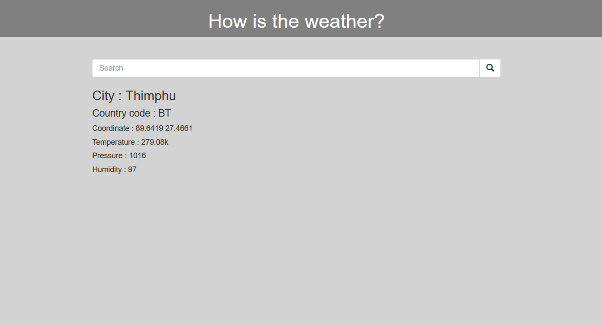

# DjangoWeather

# Installation
* 1 git clone https://github.com/Ugyenwangdi/DjangoWeather.git
* 2 create a virtual environment and activate
*  - pip install virtualenv
*  - virtualenv envname
*  - envname\scripts\activate
* 3 - pip install django
* 4 - cd into project "cd DjangoWeather"
* 5 - cd weather
* 6 - python manage.py runserver

# Features
* Query for weather by entering the place name

# Tech Stack
* Django
* HTML
* Bootstrap
* OpenWeather API

# Home Page
  

